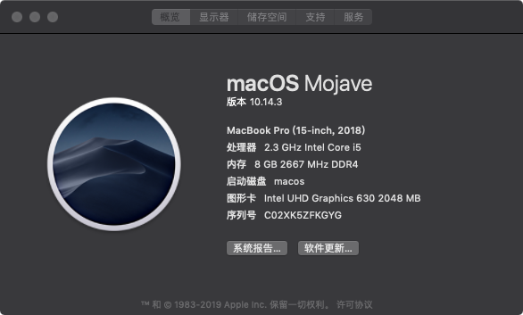
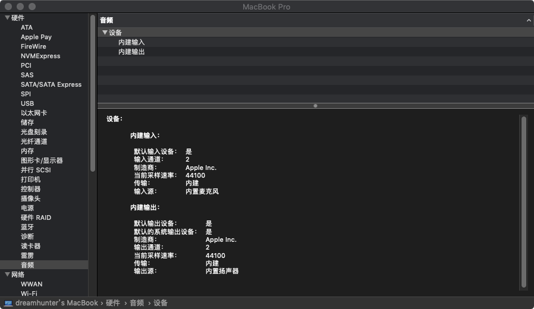
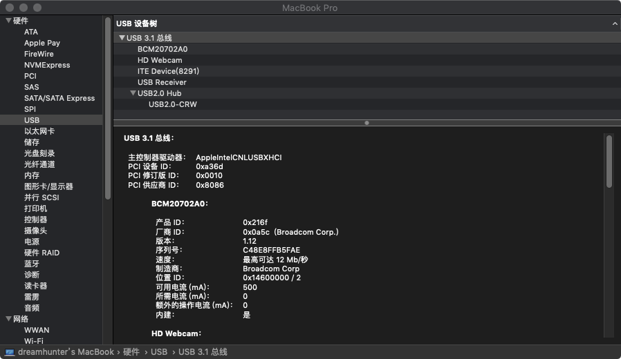
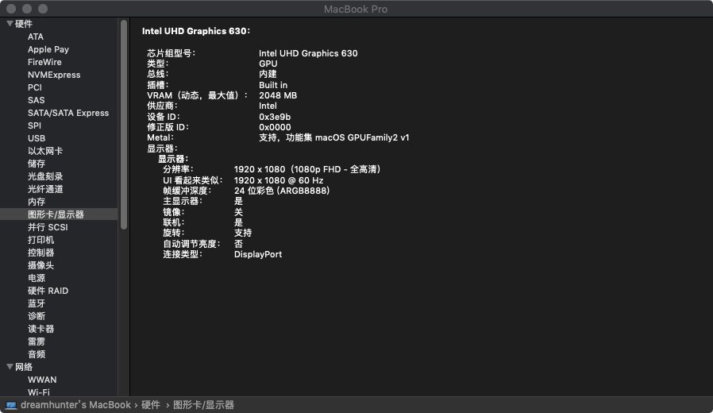
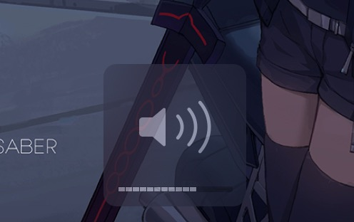
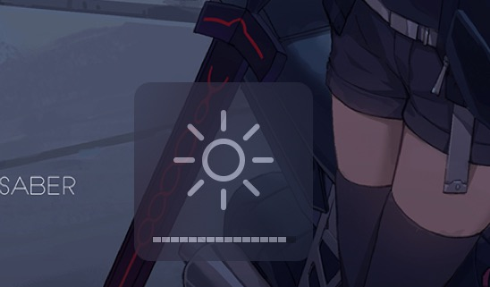

# Shinalon_YAO_7000_efi 

# 炫龙 耀7000 EFI 黑苹果

# Shinalon YAO 7000 efi  for macOS Mojave

这是我使用的 炫龙 耀7000 的CLOVER引导文件

### 电脑配置

| 规格     | 详细信息                                                |
| -------- | ----------------------------------------------------- |
| 电脑型号 | 炫龙 耀7000 笔记本电脑                                    |
| 操作系统 | macOS Mojave 18D42                                   |
| 处理器   | 英特尔 Core i5-8300H @ 2.30GHz 四核                   |
| 内存     | 16 GB ( 镁光 DDR4 2666MHz )                           |
| 硬盘     | INTEL 545S (256 GB / 固态硬盘 )                       |
| 显卡     | 英特尔 UHD Graphics 630 (platform-id:0x3E9B0000)       |
| 显示器   | 京东方 BOE  1920x1080 (15.6 英寸)                      |
| 声卡     | ALC269 (layout-id:8)                                 |
| 网卡     | 英特尔网卡已更换为Bcm94352ZAE(DW1560)                     |

### 安装镜像

直接使用黑果小兵博客中的镜像进行安装：[【黑果小兵】macOS Mojave 10.14.3 18D42 正式版 with Clover 4859原版镜像](https://blog.daliansky.net/macOS-Mojave-10.14.3-18D42-official-version-with-Clover-4859-original-image.html)

### CLOVER

* 支持Mojave
* CPU原生支持，变频正常(最低800Mhz)
* 睡眠唤醒(键盘电源键唤醒)正常
* 显卡原生支持，采用`Lilu+WhateverGreen`通过`Clover/device/Properties`方式注入
* 声卡为ALC269VC，使用 `AppleALC` ，layout-id:8，通过`Clover/device/Properties`方式注入
* 无线网卡更换为bcm94352zae(驱动教程在后面)
* 显示器亮度调节正常(重启可保存) 
* USB遮盖采用`Hackintool`生成`SSDT-UIAC.aml, SSDT-USBX.aml `，它位于`/CLOVER/ACPI/patched`
* 其它 `ACPI` 补丁修复采用 `hotpatch` 方式，文件位于 `/CLOVER/ACPI/patched`
* 电池hotpatch补丁显示电池状态正常
* 触摸板4指手势正常
* fn键可用5个功能 num键(部分情况可用 如终端)可用 

### 调整 macOS CPU性能
[使用方法](https://github.com/daliansky/XiaoMi-Pro/blob/master/one-key-cpufriend/README_CN.md)
``` bash
sh -c "$(curl -fsSL https://raw.githubusercontent.com/daliansky/XiaoMi-Pro/master/one-key-cpufriend/one-key-cpufriend_cn.sh)"
```

### HIDPI   
[开启方法](https://github.com/xzhih/one-key-hidpi)
``` bash
sh -c "$(curl -fsSL https://raw.githubusercontent.com/xzhih/one-key-hidpi/master/hidpi.sh)"
```
 **感谢 @[冰水加劲Q](https://github.com/xzhih)**

### 内置网卡无解 
[dw1560驱动教程](https://blog.daliansky.net/Broadcom-BCM94352z-DW1560-drive-new-posture.html) \
[rehanman-OS-X-BrcmPatchRAM](https://bitbucket.org/RehabMan/os-x-brcmpatchram/downloads/) \
[rehanman-OS-X-Fake-PCI-ID](https://bitbucket.org/RehabMan/os-x-fake-pci-id/downloads/) \
[acidanthera-AirportBrcmFixup](https://github.com/acidanthera/AirportBrcmFixup/releases)

### sh文件夹下camera.sh用于睡眠后重新开启摄像头 huancun.ch用于重建缓存 (需要时终端执行)

### 触摸板由[@penghubingzhou](https://github.com/penghubingzhou)大佬驱动(远景触摸群群友[@xc2333](https://github.com/Xc2333)帮忙改成hotpatch)

### 系统截图









